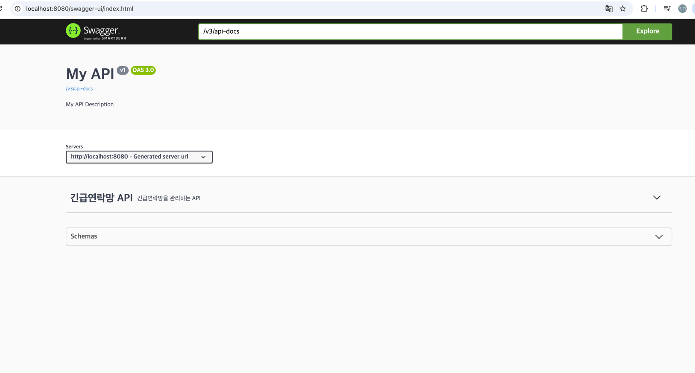

# 긴급 연락망 API

연락처를 저장하고 조회할 수 있는 웹 서버를 구축합니다.

## 필수 구현

- [X]  연락처 등록 API 구현
    - [X]  POST /api/employee
    - [X]  csv 파일로 업로드할 수 있다.
        - 파일 내에 데이터 예시
       ```
       김철수, charles@clovf.com, 01075312468, 2018.03.07
       박영희, matilda@clovf.com, 01087654321, 2021.0428
       홍길동, kildong.hong@clovf.com, 01012345678, 2015.08.15
       ```
    - [X]  json 파일로 업로드할 수 있다.
        - 파일 내에 데이터 예시
       ```json
       [
           {
               "name": "김클로",
               "email": "clo@clovf.com",
               "tel": "010-1111-2424",
               "joined": "2012-01-05"
           },
           {
               "name": "박마블",
               "email": "md@clovf.com",
               "tel": "010-3535-7979",
               "joined": "2013-07-01"
           },
           {
               "name": "홍커넥",
               "email": "connect@clovf.com",
               "tel": "010-8531-7942",
               "joined": "2019-12-05"
           }
       ]
       ```
    - [X]  csv 텍스트로 업로드할 수 있다.
    - [X]  json 텍스트로 업로드할 수 있다.
- [X]  연락처 목록 조회 API
    - [X]  GET /api/employee?page={page}&pageSize={pageSize}
    - [X]  프론트에서 페이징이 구현 가능하도록 구성해야한다.
- [X]  이름으로 연락처 조회 API
    - [X]  GET /api/empolyee/{name}
    - 이름은 unique하다고 전제로 구현한다.

## 추가 구현

- [X]  CQRS 패턴 형태의 코드 구현
    - Command와 Query를 구분해서 구현
- [X]  로그 기능 구현
- [X]  OpenAPI를 이용해 API spec 노출 구현
    - SpringDoc을 통해서 구현
- [X]  테스트 코드 작성
    - 단위 테스트 위주의 코드 작성
- [X]  설계가 변경 될 때, 반영하기 쉬운 코드 형태
    - [X]  파일의 형식이 추가될 때 쉽게 추가할 수 있는 형태로 구현
    - [X]  여러가지 날짜 형식을 추가할 수 있는 형태로 구현
    - [X]  여러가지 핸드폰번호 형식을 추가할 수 있는 형태로 구현

## Persistence Layer

- 추가설정이 필요 없도록 `H2` 사용

# 테스트 방법
## 개발 환경
- Kotlin 2.0.2, JDK 22
- SpringBoot 3.3.3

## 실행
1. Java Version을 JDK 22로 맞춥니다.
2. 아래 명령을 통해서 빌드를 실행합니다.
```shell
$ ./gradlew buikld
```
3. 애플리케이션을 실행합니다.
```shell
$ java -jar build/libs/phone-book-1.0-SNAPSHOT.jar
```

4. swagger-ui에 접속합니다.
```
http://localhost:8080/swagger-ui/index.html
```



## 긴급연락망 등록 API
string data
```
김철수, charles@clovf.com, 01075312468, 2018.03.07\n 박영희, matilda@clovf.com, 01087654321, 2021.04.28\n 홍길동, kildong.hong@clovf.com, 01012345678, 2015.08.15
```
json data
```json
[
	{
		"name": "김클로",
		"email": "clo@clovf.com",
		"tel": "010-1111-2424",
		"joined": "2012-01-05"
	},
	{
		"name": "박마블",
		"email": "md@clovf.com",
		"tel": "010-3535-7979",
		"joined": "2013-07-01"
	},
	{
		"name": "홍커넥",
		"email": "connect@clovf.com",
		"tel": "010-8531-7942",
		"joined": "2019-12-05"
	}
]
```
파일 데이터는 `assets/data`에 존재합니다.


## 긴급연락망 목록 조회 API


## 이름으로 긴급연락망 조회


# 구현 설계

## Database 설계
```SQL
CREATE TABLE employee (
    employee_id VARCHAR(32) NOT NULL,
    phone_number VARCHAR(16) NOT NULL,
    email VARCHAR(64) NOT NULL,
    joined_date DATE NOT NULL,
    created_at TIMESTAMP NOT NULL DEFAULT CURRENT_TIMESTAMP,
    modified_at TIMESTAMP NOT NULL DEFAULT CURRENT_TIMESTAMP ON UPDATE CURRENT_TIMESTAMP,
    PRIMARY KEY (employee_id)
);
```
- PK: 이름이 유니크하다고 가정하고 employee_id로 지정하였습니다.

## 패키지 구조
- `web` : 웹요청 관련 기능등를 모아두었습니다.
- `core` : 도메인, 애플리케이션등의 기능들을 모아두었습니다.
  - `command` : CRUD 중에 CUD를 기능
  - `query` : CRUD 중에 R에 해당하는 기능
  - `usecase` : 비즈니스 로직들을 담아두었습니다.
  - `model` : 도메인 모델이나 value object들을 담아두었습니다.
  - `utils` : 그외 로직들을 담아두었습니다.
- `outbound` : 비즈니스 로직에서 외부로 나가는 기능들을 모아두었습니다.

## 문제풀이
### 로직의 패키지 선정
제가 해석한 이 문제의 핵심은 기본적인 코드의 형태나 습관도 있겠지만
긴급연락망 등록 API에서 어떻게 확장할 수 있는 여러가지 형태로 연락망을 받을 수 있느냐에 있다고
생각하였습니다.
원래 Controller에 해당 로직을 모두 담아두고 싶었지만 파일이랑 String Data를 모두 하나의 엔드포인트에서
처리해야하기 때문에 Controller의 로직이 너무 복잡해질 수 있다고 생각이 들어 비즈니스 로직으로 내렸습니다.

### 로직 설계
csv 문자열, Json 문자열, csv 파일, Json 파일을 처리해야하기 때문에 추상화 단계에서
같은 타입끼리 묶는 것이 좋다고 생각이 들었습니다. 그래서 `StringParser`, `FileParser`
인터페이스를 정의하고 각 구현체에 컨텐츠의 타입(csv, json)을 객체로 변환하는 로직을 담았습니다.
이렇게 되면 `EmployeeParser`에서 `StringParser`, `FileParser` 각각을 리스트로 가지고 있기 때문에
String/파일, 컨텐츠의 타입에 따라 Parser들을 추가만 하면 되기에 OCP에 맞는 설계(기존 코드는 변경하지 않고 코드를 추가하여 확장성 있는 코드)가 될거라고 생각합니다.
